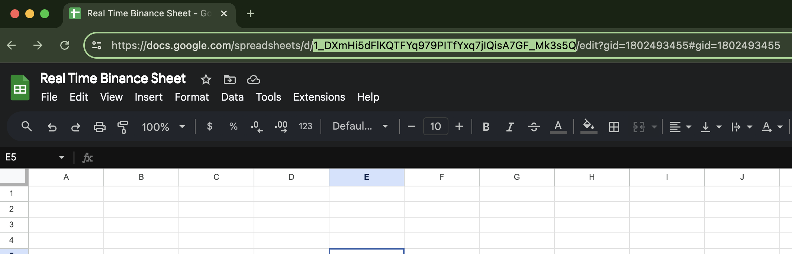

# Binance BTC Bot

### Prerequisites
**Python 3**
## Steps
* Keep **sheet_credentials.json** (Secrets) file on Real_Time_Binance_Bot Folder
* Create Google Sheet
* Share with Service Account: 
```
btcbot@binance-btc-bot.iam.gserviceaccount.com
```

### Clone To Local Machine
```
git clone https://github.com/PankajNk/Binance_BTC_Bot.git
```

### Go To Root of the Project Folder
```
cd /your_path/Binance_BTC_Bot
```

## Install directly
```shell
python install.py
```
## Running Bot in your Terminal
```shell
python Real_Time_Binance_Bot/Binance_Bot.py 
```
**Enter the Sheet ID of your Google-Sheet**

#### example:

```
Enter Sheet ID: 1_DXmHi5dFlKQTFYq979PITfYxq7jIQisA7GF_Mk3s5Q
Enter Crypto Name: ETHUSDT (or any Crypto available on Binance)
```
## You can follow only if you have any issues [Optional]
## Installation step by step
```shell
pip install -r requirements.txt
```
## If you face issue while Installing Playwright
```shell
npx playwright install
```
